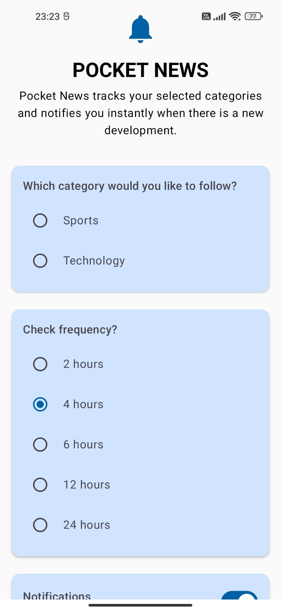
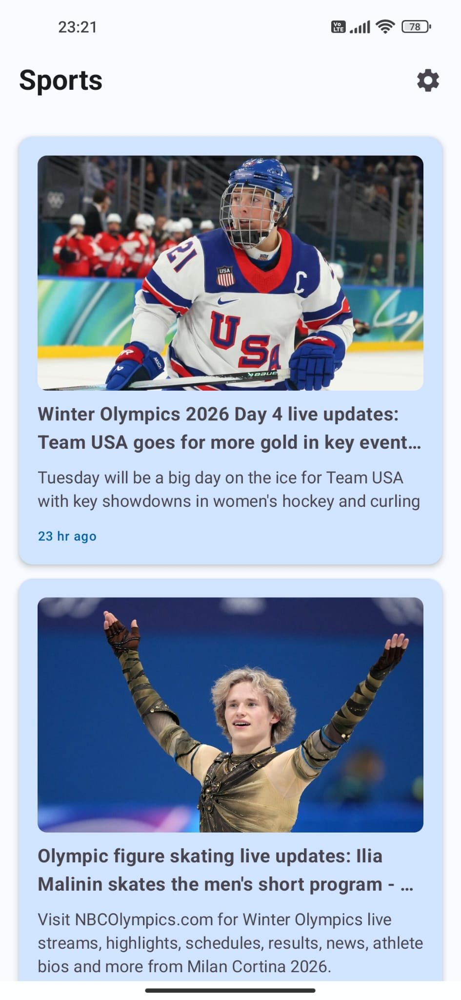
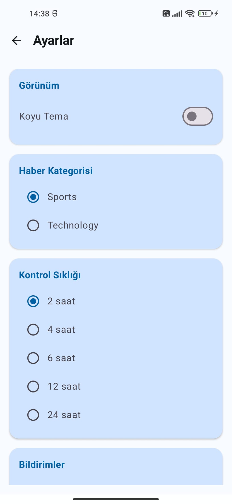
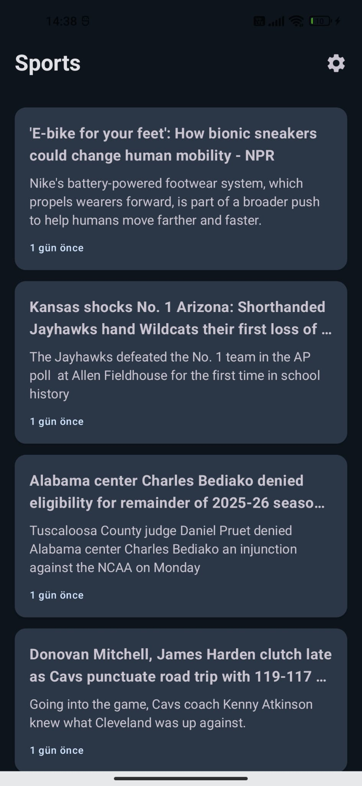
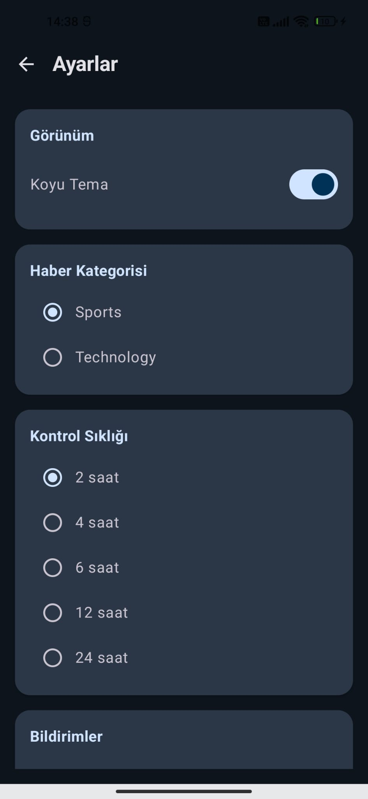
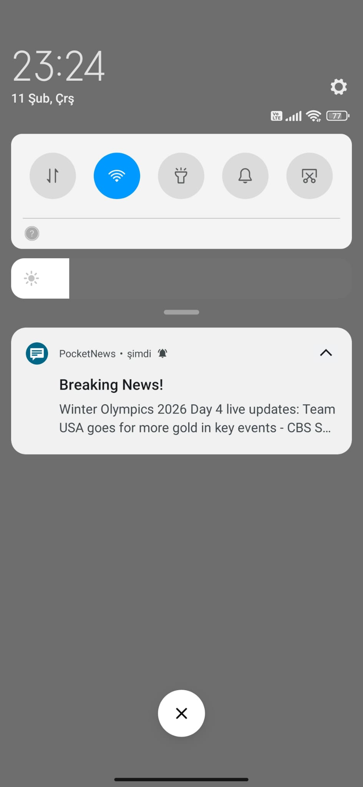
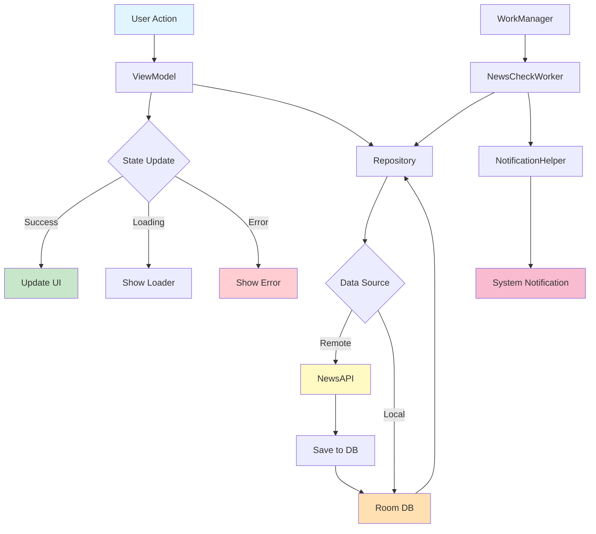

<div align="center">

# 📰 PocketNews

### Stay Updated with Personalized News Notifications

[](https://www.android.com/)
[](https://kotlinlang.org/)
[](https://developer.android.com/studio/releases/platforms#8.0)
[](https://developer.android.com/studio/releases/platforms)
[](LICENSE)
[](https://github.com/helinertgrl/PocketNews)

<p align="center">
  
</p>

**PocketNews** is a modern Android news application that delivers personalized news updates based on your interests. Built with **Jetpack Compose**, **MVVM architecture**, and **Clean Architecture** principles, it showcases best practices in Android development.

[Features](#-features) • [Screenshots](#-screenshots) • [Tech Stack](#-tech-stack) • [Architecture](#-architecture) • [Installation](#-installation) • [CI/CD](#-cicd)

</div>

---

## ✨ Features

<table>
<tr>
<td width="50%">

### 🎯 Core Functionality
- **Personalized News Feed** - Choose from Sports & Technology categories
- **Smart Notifications** - Get instant alerts for breaking news
- **Background Sync** - Automatic news updates via WorkManager
- **Offline-First** - Room database for seamless offline access
- **Pull-to-Refresh** - Intuitive gesture to fetch latest news

</td>
<td width="50%">

### 🎨 User Experience
- **Material 3 Design** - Modern, clean UI with custom theming
- **Dark Mode** - Eye-friendly dark theme support
- **Smooth Onboarding** - First-time user setup flow
- **Customizable Settings** - Adjust check frequency (2-24 hours)
- **Responsive Cards** - Beautiful news cards with images

</td>
</tr>
</table>

---

## 📱 Screenshots

<div align="center">

### Light Theme

<table>
<tr>
<td align="center" width="33%">

<br />
<strong>Onboarding</strong>
</td>
<td align="center" width="33%">

<br />
<strong>Home Screen</strong>
</td>
<td align="center" width="33%">

<br />
<strong>Settings</strong>
</td>
</tr>
</table>

### Dark Theme

<table>
<tr>
<td align="center" width="50%">

<br />
<strong>Home Screen (Dark)</strong>
</td>
<td align="center" width="50%">

<br />
<strong>Settings (Dark)</strong>
</td>
</tr>
</table>

### Notifications

<table>
<tr>
<td align="center">

<br />
<strong>Push Notification</strong>
</td>
</tr>
</table>

</div>

---

## 🛠️ Tech Stack

<table>
<tr>
<td valign="top" width="33%">

#### 🎨 UI Layer
- **Jetpack Compose** - Modern declarative UI
- **Material 3** - Latest Material Design
- **Coil** - Async image loading
- **Navigation Compose** - Type-safe navigation

</td>
<td valign="top" width="33%">

#### 🏗️ Architecture & DI
- **MVVM Pattern** - Clean separation of concerns
- **Clean Architecture** - Modular, testable code
- **Hilt** - Dependency injection
- **Kotlin Coroutines** - Asynchronous programming
- **StateFlow** - Reactive state management

</td>
<td valign="top" width="33%">

#### 💾 Data Layer
- **Room Database** - Local data persistence
- **DataStore** - Preferences management
- **Retrofit** - REST API integration
- **WorkManager** - Background task scheduling
- **Firebase Cloud Messaging** - Push notifications

</td>
</tr>
</table>

### 📦 Dependencies

```kotlin
// UI
androidx.compose.material3
androidx.navigation:navigation-compose
io.coil-kt:coil-compose

// Dependency Injection
com.google.dagger:hilt-android
androidx.hilt:hilt-navigation-compose

// Networking
com.squareup.retrofit2:retrofit
com.squareup.retrofit2:converter-gson
com.squareup.okhttp3:logging-interceptor

// Database
androidx.room:room-runtime
androidx.room:room-ktx

// Background Tasks
androidx.work:work-runtime-ktx
androidx.hilt:hilt-work

// Storage
androidx.datastore:datastore-preferences

// Firebase
com.google.firebase:firebase-messaging-ktx
```

---

## 🏛️ Architecture

PocketNews follows **Clean Architecture** principles with clear separation of layers:

```
┌─────────────────────────────────────────────────────────────┐
│                     PRESENTATION LAYER                      │
│  ┌──────────────┐  ┌──────────────┐  ┌──────────────┐     │
│  │   Compose    │  │  ViewModel   │  │    Screen    │     │
│  │     UI       │◄─┤   (State)    │◄─┤  Navigation  │     │
│  └──────────────┘  └──────────────┘  └──────────────┘     │
└────────────────────────────┬────────────────────────────────┘
                             │
┌────────────────────────────▼────────────────────────────────┐
│                      DOMAIN LAYER                           │
│  ┌──────────────┐  ┌──────────────┐  ┌──────────────┐     │
│  │  Use Cases   │  │   Models     │  │ Repository   │     │
│  │  (Business)  │  │  (Entities)  │  │  Interface   │     │
│  └──────────────┘  └──────────────┘  └──────────────┘     │
└────────────────────────────┬────────────────────────────────┘
                             │
┌────────────────────────────▼────────────────────────────────┐
│                       DATA LAYER                            │
│  ┌──────────────┐  ┌──────────────┐  ┌──────────────┐     │
│  │   Room DB    │  │  Retrofit    │  │  DataStore   │     │
│  │   (Local)    │  │  (Remote)    │  │ (Preferences)│     │
│  └──────────────┘  └──────────────┘  └──────────────┘     │
└─────────────────────────────────────────────────────────────┘
```

### 📂 Project Structure

```
com.example.pocketnews/
├── 📱 presentation/          # UI Layer
│   ├── home/
│   │   ├── HomeScreen.kt
│   │   ├── HomeViewModel.kt
│   │   └── components/
│   │       └── NewsCard.kt
│   ├── onboarding/
│   │   ├── OnboardingScreen.kt
│   │   └── OnboardingViewModel.kt
│   ├── settings/
│   │   ├── SettingsScreen.kt
│   │   └── SettingsViewModel.kt
│   └── Navigation.kt
│
├── 🏢 domain/                # Business Logic
│   ├── model/
│   │   ├── NewsArticle.kt
│   │   └── NewsResponse.kt
│   └── repository/
│       └── NewsRepository.kt
│
├── 💾 data/                  # Data Sources
│   ├── local/
│   │   ├── NewsDatabase.kt
│   │   ├── NewsDao.kt
│   │   ├── NewsArticleEntity.kt
│   │   └── PreferencesManager.kt
│   ├── remote/
│   │   ├── NewsApiService.kt
│   │   └── RetrofitInstance.kt
│   └── repository/
│       └── NewsRepositoryImpl.kt
│
├── 💉 di/                    # Dependency Injection
│   ├── AppModule.kt
│   └── WorkerModule.kt
│
├── ⚙️ worker/                # Background Tasks
│   ├── NewsCheckWorker.kt
│   └── NewsWorkManager.kt
│
├── 🛠️ utils/                 # Utilities
│   └── NotificationHelper.kt
│
└── 🎨 ui/theme/              # UI Theme
    ├── Color.kt
    ├── Theme.kt
    └── Type.kt
```

---

## 🔄 Data Flow Diagram



---

## 🚀 Installation

### Prerequisites

- Android Studio Meerkat | 2024.3.1 or newer
- JDK 17
- Android SDK (API 26-36)

### Setup Instructions

1. **Clone the repository**
   ```bash
   git clone https://github.com/helinertgrl/PocketNews.git
   cd PocketNews
   ```

2. **Get NewsAPI Key**
   - Visit [NewsAPI.org](https://newsapi.org/)
   - Sign up and get your free API key
   - Open your gradle.properties file in the project root.
   - Add your API key as a String:
   ```kotlin
   NEWS_API_KEY="your_api_key_here"
   ```
   -The project is configured to inject this key via BuildConfig for security.

3. **Firebase Setup (Optional for FCM)**
   - Create a project in [Firebase Console](https://console.firebase.google.com/)
   - Add your Android app
   - Download `google-services.json`
   - Place it in `app/` directory

4. **Build & Run**
   ```bash
   ./gradlew build
   ./gradlew installDebug
   ```

   Or simply click ▶️ Run in Android Studio

---


### Update Intervals

Users can customize news check frequency:

| Interval | Use Case |
|----------|----------|
| **2 hours** | Breaking news enthusiasts |
| **4 hours** | Regular updates (Default) |
| **6 hours** | Balanced approach |
| **12 hours** | Twice daily |
| **24 hours** | Daily digest |

---

## 🔄 CI/CD

The project includes **GitHub Actions** workflow for automated builds and tests.

### Workflow Features

```yaml
name: Android CI

on:
  push:
    branches: [ main, develop ]
  pull_request:
    branches: [ main ]

jobs:
  build:
    runs-on: ubuntu-latest
    steps:
      - ✅ Checkout code
      - ⚙️ Setup JDK 17
      - 🔧 Grant execute permission
      - 🏗️ Build with Gradle
      - 🧪 Run unit tests
      - 📦 Upload APK artifact
```

### Build Status


---


## 📊 API Reference

### NewsAPI Integration

**Endpoint**: `GET /v2/top-headlines`

**Parameters**:
| Parameter | Type | Description |
|-----------|------|-------------|
| `country` | String | Country code (e.g., "us") |
| `category` | String | News category |
| `apiKey` | String | Injected via BuildConfig |

**Response**:
```json
{
  "status": "ok",
  "totalResults": 38,
  "articles": [
    {
      "source": { "name": "CBS Sports" },
      "title": "Winter Olympics 2026...",
      "description": "Tuesday will be...",
      "url": "https://...",
      "urlToImage": "https://...",
      "publishedAt": "2024-02-11T23:21:00Z"
    }
  ]
}
```

---

## 🎯 Key Learnings & Best Practices

This project demonstrates:

### 🏗️ Architecture
- ✅ **MVVM** with clear separation of concerns
- ✅ **Clean Architecture** for scalability
- ✅ **Repository Pattern** for data abstraction
- ✅ **Dependency Injection** with Hilt

### 🎨 Modern Android Development
- ✅ **Jetpack Compose** for declarative UI
- ✅ **Material 3** design system
- ✅ **Kotlin Coroutines** for async operations
- ✅ **StateFlow** for reactive state management

### 💾 Data Management
- ✅ **Room** for local persistence
- ✅ **DataStore** for preferences
- ✅ **Offline-first** architecture
- ✅ **WorkManager** for background sync

### 🔔 Background Processing
- ✅ **Periodic WorkManager** tasks
- ✅ **Push Notifications** with FCM
- ✅ **Battery-efficient** background jobs

---

## 🐛 Known Issues & Roadmap

### Current Limitations
- [ ] Limited to 2 news categories (Sports, Technology)
- [ ] API rate limiting (100 requests/day on free tier)
- [ ] No search functionality

### Future Enhancements
- [ ] 🔍 Search news articles
- [ ] 📑 Multiple categories support
- [ ] 🔖 Bookmark favorite articles
- [ ] 📤 Share articles on social media
- [ ] 📊 Analytics dashboard

---

## 🤝 Contributing

Contributions are welcome! Please follow these steps:

1. Fork the repository
2. Create your feature branch (`git checkout -b feature/AmazingFeature`)
3. Commit your changes (`git commit -m 'Add some AmazingFeature'`)
4. Push to the branch (`git push origin feature/AmazingFeature`)
5. Open a Pull Request

### Code Style

This project follows:
- [Kotlin Coding Conventions](https://kotlinlang.org/docs/coding-conventions.html)
- [Android Kotlin Style Guide](https://developer.android.com/kotlin/style-guide)

---

## 📄 License

This project is licensed under the MIT License - see the [LICENSE](LICENSE) file for details.

```
MIT License

Copyright (c) 2026 Helin

Permission is hereby granted, free of charge, to any person obtaining a copy
of this software and associated documentation files (the "Software"), to deal
in the Software without restriction...
```

---

## 👨‍💻 Author

**Helin**

- 📧 Email: helinertgrll@gmail.com
- 💼 LinkedIn: [linkedin.com/in/yourprofile](https://www.linkedin.com/in/helin-ertuğrul/)

---


<div align="center">

### ⭐ Star this repository if you find it helpful!

Made with ❤️ by Helin


</div>
