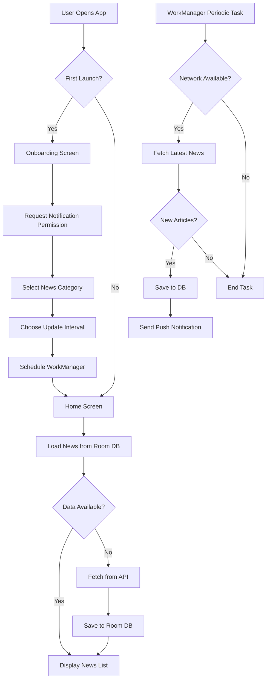
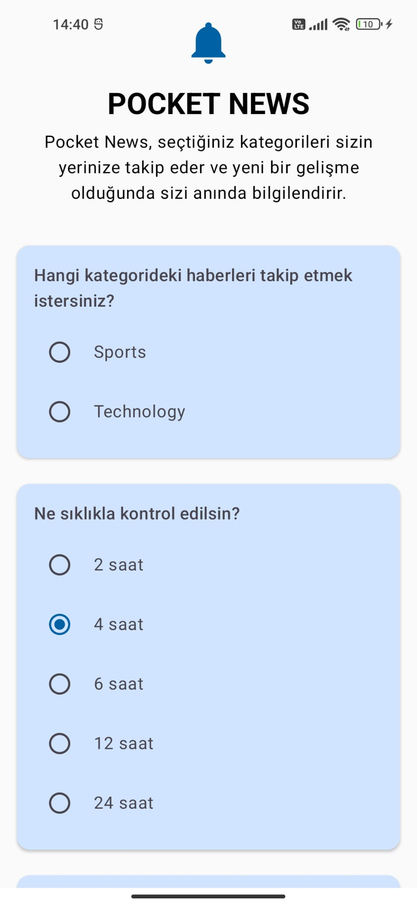
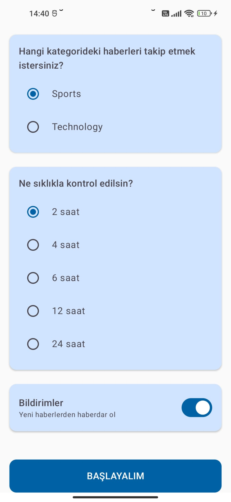

# 📰 PocketNews

<div align="center">


**A modern, intelligent news aggregation app that delivers personalized news updates with smart notifications**

[Features](#-features) • [Architecture](#-architecture) • [Tech Stack](#-tech-stack) • [Setup](#-setup) • [Screenshots](#-screenshots)

</div>

---

## 📋 Overview

PocketNews is a sophisticated Android application built with modern Android development practices. The app monitors selected news categories and intelligently notifies users about breaking news through background processing. Built entirely with **Kotlin** and **Jetpack Compose**, it demonstrates best practices in Android development including Clean Architecture, dependency injection, and background task management.

### 🎯 Key Highlights

- **100% Kotlin** - Modern, type-safe programming
- **Jetpack Compose UI** - Declarative, reactive UI framework
- **Clean Architecture** - Separation of concerns with MVVM pattern
- **Background Processing** - Intelligent news monitoring with WorkManager
- **Local Persistence** - Room database for offline-first approach
- **Dependency Injection** - Hilt for scalable architecture
- **CI/CD Pipeline** - Automated builds and tests with GitHub Actions

---

## ✨ Features

### Core Functionality

| Feature | Description |
|---------|-------------|
| 🔔 **Smart Notifications** | Background worker checks for new articles and sends timely push notifications |
| 📱 **Material Design 3** | Modern UI following latest Material Design guidelines |
| 🌙 **Dark Mode Support** | System-aware theme switching for better user experience |
| 🔄 **Pull-to-Refresh** | Instant manual refresh capability with smooth animations |
| ⚙️ **Customizable Settings** | User-defined news categories and update intervals (2-24 hours) |
| 💾 **Offline Support** | Room database caches articles for offline reading |
| 🚀 **Onboarding Flow** | First-launch experience with permission handling |

### Technical Features

- **Periodic Background Sync** - WorkManager schedules automatic news checks
- **Network Monitoring** - Constraints ensure sync only on connected networks
- **State Management** - Flow-based reactive data streams
- **DataStore Preferences** - Type-safe preference storage
- **Runtime Permissions** - POST_NOTIFICATIONS permission handling (Android 13+)
- **Deep Linking** - Opens news articles in external browser

---

## 🏗️ Architecture

### Clean Architecture Layers

```
┌─────────────────────────────────────────────────────────┐
│                    Presentation Layer                    │
│  ┌────────────┐  ┌──────────┐  ┌──────────────────┐    │
│  │  Compose   │  │ViewModel │  │   Navigation     │    │
│  │     UI     │  │  (MVVM)  │  │    Component     │    │
│  └────────────┘  └──────────┘  └──────────────────┘    │
└─────────────────────────────────────────────────────────┘
                          ↕
┌─────────────────────────────────────────────────────────┐
│                      Domain Layer                        │
│  ┌──────────────────┐         ┌──────────────────┐     │
│  │   Use Cases      │         │    Repository    │     │
│  │   (Business      │    →    │    Interface     │     │
│  │     Logic)       │         │                  │     │
│  └──────────────────┘         └──────────────────┘     │
└─────────────────────────────────────────────────────────┘
                          ↕
┌─────────────────────────────────────────────────────────┐
│                       Data Layer                         │
│  ┌──────────┐  ┌──────────┐  ┌────────────────────┐   │
│  │  Remote  │  │   Local  │  │   Repository       │   │
│  │   (API)  │  │  (Room)  │  │  Implementation    │   │
│  └──────────┘  └──────────┘  └────────────────────┘   │
└─────────────────────────────────────────────────────────┘
```

### Project Structure

```
com.example.pocketnews/
│
├── data/
│   ├── local/
│   │   ├── NewsArticleEntity.kt      # Room entity
│   │   ├── NewsDao.kt                # Database access object
│   │   ├── NewsDatabase.kt           # Room database
│   │   └── PreferencesManager.kt     # DataStore wrapper
│   │
│   ├── remote/
│   │   ├── NewsApiService.kt         # Retrofit interface
│   │   └── RetrofitInstance.kt       # Retrofit singleton
│   │
│   └── repository/
│       └── NewsRepositoryImpl.kt     # Repository implementation
│
├── domain/
│   ├── model/
│   │   ├── NewsArticle.kt            # Domain model
│   │   └── NewsResponse.kt           # API response model
│   │
│   └── repository/
│       └── NewsRepository.kt         # Repository contract
│
├── di/
│   ├── AppModule.kt                  # Hilt dependency module
│   └── WorkerModule.kt               # Worker factory module
│
├── presentation/
│   ├── home/
│   │   ├── HomeScreen.kt             # Main news feed
│   │   ├── HomeViewModel.kt          # State management
│   │   └── components/
│   │       └── NewsCard.kt           # Reusable card component
│   │
│   ├── onboarding/
│   │   ├── OnboardingScreen.kt       # First launch setup
│   │   └── OnboardingViewModel.kt    # Onboarding state
│   │
│   ├── settings/
│   │   ├── SettingsScreen.kt         # App configuration
│   │   └── SettingsViewModel.kt      # Settings state
│   │
│   └── Navigation.kt                 # Navigation graph
│
├── ui/
│   └── theme/                        # Material3 theming
│
├── utils/
│   └── NotificationHelper.kt         # Notification manager
│
├── worker/
│   ├── NewsCheckWorker.kt            # Background sync worker
│   └── NewsWorkManager.kt            # WorkManager scheduler
│
├── MainActivity.kt                   # Entry point
└── PocketNewsApp.kt                  # Application class
```

---

## 🛠️ Tech Stack

### Core Technologies

| Category | Technology | Purpose |
|----------|-----------|---------|
| **Language** | Kotlin 100% | Type-safe, modern programming |
| **UI Framework** | Jetpack Compose | Declarative UI toolkit |
| **Architecture** | MVVM + Clean Architecture | Separation of concerns |
| **Dependency Injection** | Hilt (Dagger) | Scalable DI framework |
| **Async Programming** | Coroutines + Flow | Reactive, non-blocking operations |

### Jetpack Components

| Component | Usage |
|-----------|-------|
| **Compose** | Modern declarative UI |
| **ViewModel** | UI state management |
| **Navigation Compose** | Type-safe navigation |
| **Room** | Local database ORM |
| **DataStore** | Type-safe preferences |
| **WorkManager** | Background task scheduling |
| **Lifecycle** | Lifecycle-aware components |

### Third-Party Libraries

| Library | Version | Purpose |
|---------|---------|---------|
| **Retrofit** | 2.11.0 | REST API client |
| **OkHttp** | 4.12.0 | HTTP client & interceptor |
| **Gson** | 2.11.0 | JSON serialization |
| **Hilt** | 2.52 | Dependency injection |
| **Room** | 2.6.1 | SQLite database wrapper |

### Development Tools

- **Gradle (KTS)** - Build configuration with Kotlin DSL
- **KSP** - Kotlin Symbol Processing for annotation processors
- **GitHub Actions** - CI/CD automation
- **Material Design 3** - Latest design system

---

## 🔄 Data Flow



---

## 📸 Screenshots

### Light Theme

<div align="center">

| Onboarding | Onboarding Categories | Home Screen |
|:----------:|:------------------:|:-----------:|
|  |  |  |

| Settings | Notification |
|:--------:|:------------:|
|  |  |

</div>

### Dark Theme

<div align="center">

| Home Screen | Settings |
|:-----------:|:--------:|
|  |  |

</div>

---

## 🚀 Setup

### Prerequisites

- **Android Studio** Hedgehog (2023.1.1) or later
- **JDK** 17 or higher
- **Gradle** 8.0+
- **Min SDK** 26 (Android 8.0)
- **Target SDK** 36 (Android 15)

### Installation Steps

1. **Clone the repository**
   ```bash
   git clone https://github.com/helinertgrl/pocketnews.git
   cd pocketnews
   ```

2. **Open in Android Studio**
   - File → Open → Select the project directory

3. **Get API Key**
   - Sign up at [NewsAPI.org](https://newsapi.org/)
   - Get your free API key

4. **Configure API Key**
   
   Create `local.properties` in project root:
   ```properties
   NEWS_API_KEY=your_api_key_here
   ```
   
   Or directly in `NewsRepositoryImpl.kt` (line 18):
   ```kotlin
   apiKey = "YOUR_API_KEY"
   ```

5. **Sync Gradle**
   ```bash
   ./gradlew build
   ```

6. **Run the app**
   - Select emulator or physical device
   - Click Run ▶️

### Firebase Setup (Optional - For FCM)

1. Create Firebase project at [console.firebase.google.com](https://console.firebase.google.com)
2. Download `google-services.json`
3. Place in `app/` directory
4. Sync project

---


## 📦 CI/CD Pipeline

### GitHub Actions Workflow

The project uses automated CI/CD with the following stages:

```yaml
name: Android CI

on: [push, pull_request]

jobs:
  build:
    runs-on: ubuntu-latest
    steps:
      - Checkout code
      - Setup JDK 17
      - Grant execute permission to gradlew
      - Build with Gradle
      - Run tests
      - Upload APK artifact
```

**Current Status:** 

---

## 🗺️ Roadmap

- [ ] **Search Functionality** - Full-text search across articles
- [ ] **Bookmark System** - Save articles for later reading
- [ ] **Share Integration** - Share articles to social media
- [ ] **Multiple Categories** - Support selecting multiple categories
- [ ] **In-App Browser** - WebView for reading articles
- [ ] **Analytics Integration** - Firebase Analytics tracking

---

## 🤝 Contributing

Contributions are welcome! Please follow these steps:

1. Fork the repository
2. Create your feature branch (`git checkout -b feature/AmazingFeature`)
3. Commit your changes (`git commit -m 'Add some AmazingFeature'`)
4. Push to the branch (`git push origin feature/AmazingFeature`)
5. Open a Pull Request

### Code Style
- Follow [Kotlin Coding Conventions](https://kotlinlang.org/docs/coding-conventions.html)
- Use meaningful variable and function names
- Add comments for complex logic
- Write unit tests for new features

---

## 📝 License

This project is licensed under the MIT License - see the [LICENSE](LICENSE) file for details.

---

## 👤 Author

**Helin Ertugrul**

- GitHub: [@helinertgrl](https://github.com/helinertgrl)
- LinkedIn: [Helin Ertugrul](https://www.linkedin.com/in/helin-ertuğrul/) 

---


<div align="center">

### ⭐ Star this repository if you found it helpful!

**Built with ❤️ using Kotlin & Jetpack Compose**

</div>
